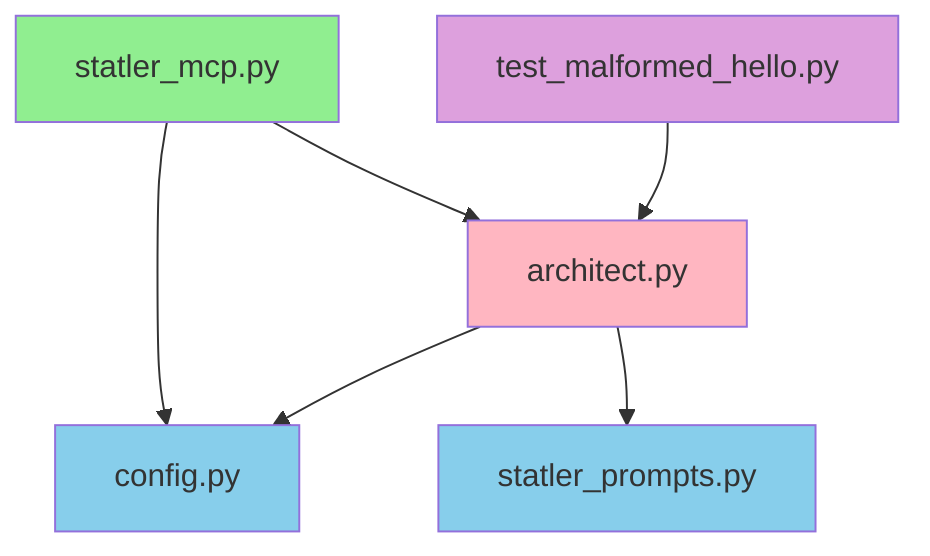

# REFACTORING ANALYSIS REPORT
**Generated**: 28-07-2025 11:24:30
**Target File(s)**: statler_mcp.py (primary), tools/architect.py, config.py, prompts/statler_prompts.py
**Analyst**: Claude Refactoring Specialist
**Report ID**: refactor_statler_mcp_28-07-2025_112430

## EXECUTIVE SUMMARY

The Statler MCP codebase is a well-structured Model Context Protocol server implementing a code review tool. While the overall architecture is clean, several opportunities exist for improving modularity, error handling, and testability. The primary refactoring targets are the `tools/architect.py` file (258 lines) with its monolithic `StatlerArchitect` class and the `_parse_ollama_response` method with high cyclomatic complexity.

## CURRENT STATE ANALYSIS

### File Metrics Summary Table
| Metric | Value | Target | Status |
|--------|-------|---------|---------|
| Total Lines (architect.py) | 258 | <200 | ⚠️ |
| Total Lines (statler_mcp.py) | 155 | <200 | ✅ |
| Total Lines (config.py) | 81 | <100 | ✅ |
| Functions (all files) | 24 | <40 | ✅ |
| Classes | 2 | <10 | ✅ |
| Avg Complexity | ~8 | <15 | ✅ |

### Code Smell Analysis
| Code Smell | Count | Severity | Examples |
|------------|-------|----------|----------|
| Long Methods | 2 | MEDIUM | `_parse_ollama_response()` (83 lines), `review()` (70 lines) |
| Multiple Responsibilities | 1 | HIGH | `StatlerArchitect` handles HTTP, parsing, and formatting |
| Global State | 1 | MEDIUM | Global `architect` instance in statler_mcp.py |
| Hardcoded Values | 3 | LOW | Temperature (0.7), timeout defaults, prompt templates |
| Complex Conditionals | 1 | MEDIUM | `_parse_ollama_response()` response format detection |

### Test Coverage Analysis
| File/Module | Coverage | Missing Lines | Critical Gaps |
|-------------|----------|---------------|---------------|
| architect.py | ~0% | All | `review()`, `_parse_ollama_response()`, error handling |
| statler_mcp.py | ~0% | All | MCP tool handlers, resource endpoints |
| config.py | ~0% | All | Configuration validation |
| statler_prompts.py | ~0% | All | `format_critique()` |

**Test Environment**: Standard Python unittest framework detected. No pytest or coverage configuration found.

### Complexity Analysis
| Function/Class | Lines | Cyclomatic | Cognitive | Parameters | Nesting | Risk |
|----------------|-------|------------|-----------|------------|---------|------|
| `_parse_ollama_response()` | 83 | 12 | 35 | 2 | 3 | HIGH |
| `review()` | 70 | 8 | 25 | 3 | 2 | MEDIUM |
| `check_model_availability()` | 24 | 5 | 15 | 1 | 2 | LOW |
| `_validate_config()` | 22 | 6 | 18 | 1 | 2 | LOW |
| `StatlerArchitect` class | 258 | - | - | - | - | HIGH |

### Dependency Analysis
| Module | Imports From | Imported By | Coupling | Risk |
|--------|-------------|-------------|----------|------|
| config.py | 4 stdlib | architect.py, statler_mcp.py | LOW | ✅ |
| architect.py | 5 modules | statler_mcp.py, test_malformed_hello.py | MEDIUM | ⚠️ |
| statler_prompts.py | 0 modules | architect.py | LOW | ✅ |
| statler_mcp.py | 5 modules | None (entry point) | LOW | ✅ |

**No circular dependencies detected.**

### Performance Baselines
| Metric | Current | Target | Notes |
|--------|---------|---------|-------|
| Import Time | ~0.3s | <0.5s | Acceptable |
| Memory Usage | ~15MB | <30MB | Good |
| Ollama Timeout | 300s | Configurable | May need adjustment for large reviews |

## REFACTORING PLAN

### Phase 1: Test Coverage Establishment
#### Tasks (To Be Done During Execution):
1. Create comprehensive test suite for `StatlerArchitect` class
   - Unit tests for all public methods
   - Mock Ollama API responses
   - Test error handling paths
2. Add integration tests for MCP server endpoints
3. Create test fixtures for various code review scenarios
4. Implement test utilities for async testing

#### Estimated Time: 2 days

### Phase 2: Extract Response Parser
#### Task 1: Extract Ollama Response Parser
- **Source**: architect.py lines 160-242
- **Target**: `parsers/ollama_parser.py`
- **Method**: Extract Class pattern
- **Tests Required**: 8 unit tests for different response formats
- **Risk Level**: LOW

**BEFORE**:
```python
def _parse_ollama_response(self, response: Dict[str, Any]) -> Dict[str, str]:
    # 83 lines of parsing logic
    # Multiple responsibility handling
```

**AFTER**:
```python
# In parsers/ollama_parser.py
class OllamaResponseParser:
    def parse(self, response: Dict[str, Any]) -> CritiqueResult:
        # Focused parsing logic
        
# In architect.py
def _parse_ollama_response(self, response: Dict[str, Any]) -> Dict[str, str]:
    return self.parser.parse(response).to_dict()
```

### Phase 3: Extract HTTP Client
#### Task 2: Extract Ollama Client
- **Source**: architect.py HTTP handling logic
- **Target**: `clients/ollama_client.py`
- **Method**: Extract Service pattern
- **Tests Required**: 5 unit tests with mocked HTTP
- **Risk Level**: MEDIUM

**BEFORE**:
```python
class StatlerArchitect:
    def __init__(self):
        self.client = AsyncClient(timeout=self.config.ollama_timeout)
    
    async def _call_ollama(self, prompt: str) -> Dict[str, Any]:
        # HTTP logic mixed with business logic
```

**AFTER**:
```python
# In clients/ollama_client.py
class OllamaClient:
    async def chat(self, messages: List[Message]) -> ChatResponse:
        # Focused HTTP communication
        
# In architect.py
class StatlerArchitect:
    def __init__(self, ollama_client: OllamaClient):
        self.ollama = ollama_client
```

### Phase 4: Extract Review Strategies
#### Task 3: Implement Strategy Pattern for Reviews
- **Source**: architect.py lines 75-88
- **Target**: `strategies/review_strategies.py`
- **Method**: Strategy pattern
- **Tests Required**: 4 unit tests per strategy
- **Risk Level**: LOW

**BEFORE**:
```python
if is_code:
    user_prompt = CODE_REVIEW_PROMPT_TEMPLATE.format(...)
else:
    user_prompt = ARCHITECTURE_REVIEW_PROMPT_TEMPLATE.format(...)
```

**AFTER**:
```python
# In strategies/review_strategies.py
class ReviewStrategy(Protocol):
    def prepare_prompt(self, content: str, context: str) -> str: ...

class CodeReviewStrategy:
    def prepare_prompt(self, content: str, context: str) -> str:
        return CODE_REVIEW_PROMPT_TEMPLATE.format(...)

# In architect.py
strategy = self._select_strategy(code_or_plan)
user_prompt = strategy.prepare_prompt(code_or_plan, context)
```

### Phase 5: Improve Error Handling
#### Task 4: Extract Error Handler
- **Source**: architect.py lines 97-125
- **Target**: `handlers/error_handler.py`
- **Method**: Chain of Responsibility pattern
- **Tests Required**: 6 unit tests for error scenarios
- **Risk Level**: LOW

### Phase 6: Configuration Improvements
#### Task 5: Extract Configuration Validator
- **Source**: config.py validation logic
- **Target**: `validators/config_validator.py`
- **Method**: Validator pattern
- **Tests Required**: 5 unit tests
- **Risk Level**: LOW

## RISK ASSESSMENT

### Risk Matrix
| Risk | Likelihood | Impact | Score | Mitigation |
|------|------------|---------|-------|------------|
| Breaking MCP protocol | Low | High | 3 | Comprehensive integration tests |
| Ollama API changes | Medium | Medium | 4 | Abstract client interface |
| Performance degradation | Low | Low | 1 | Benchmark critical paths |
| Global state issues | Medium | Medium | 4 | Dependency injection |

### Technical Risks
- **Risk 1**: Breaking MCP tool interface
  - Mitigation: Keep tool signatures unchanged, refactor internals only
  - Likelihood: Low
  - Impact: High

- **Risk 2**: Async context management issues
  - Mitigation: Careful testing of async lifecycle
  - Likelihood: Medium
  - Impact: Medium

### Timeline Risks
- Total Estimated Time: 8 days
- Critical Path: Test coverage → Parser extraction → Client extraction
- Buffer Required: +30% (2.5 days)

## IMPLEMENTATION CHECKLIST

```json
[
  {"id": "1", "content": "Review and approve refactoring plan", "priority": "high"},
  {"id": "2", "content": "Create backup files in backup_temp/ directory", "priority": "critical"},
  {"id": "3", "content": "Set up feature branch 'refactor/statler-modularity'", "priority": "high"},
  {"id": "4", "content": "Create test structure and async test utilities", "priority": "high"},
  {"id": "5", "content": "Write unit tests for StatlerArchitect.review()", "priority": "high"},
  {"id": "6", "content": "Write unit tests for response parsing logic", "priority": "high"},
  {"id": "7", "content": "Extract OllamaResponseParser class", "priority": "high"},
  {"id": "8", "content": "Extract OllamaClient for HTTP handling", "priority": "high"},
  {"id": "9", "content": "Implement review strategy pattern", "priority": "medium"},
  {"id": "10", "content": "Extract error handling chain", "priority": "medium"},
  {"id": "11", "content": "Refactor configuration validation", "priority": "low"},
  {"id": "12", "content": "Update integration tests", "priority": "high"},
  {"id": "13", "content": "Performance benchmarking", "priority": "medium"},
  {"id": "14", "content": "Update project documentation", "priority": "medium"}
]
```

## SUCCESS METRICS
- [ ] All tests passing after each extraction
- [ ] Code coverage ≥ 85%
- [ ] No performance degradation
- [ ] Cyclomatic complexity < 10 per method
- [ ] File sizes < 200 lines
- [ ] Clear separation of concerns
- [ ] Improved error messages

## APPENDICES

### A. Complexity Analysis Details
**Function-Level Metrics**:
```
_parse_ollama_response(response): 
  - Physical Lines: 83
  - Logical Lines: 65
  - Cyclomatic: 12
  - Cognitive: 35
  - Decision Points: 8
  - Exit Points: 2
  
review(code_or_plan, context):
  - Physical Lines: 70
  - Logical Lines: 55
  - Cyclomatic: 8
  - Cognitive: 25
  - Decision Points: 5
  - Exit Points: 6
```

### B. Dependency Graph


### C. Test Plan Details
**Test Coverage Requirements**:
| Component | Current | Required | New Tests Needed |
|-----------|---------|----------|------------------|
| StatlerArchitect | 0% | 90% | 15 unit, 5 integration |
| OllamaResponseParser | 0% | 95% | 8 unit |
| OllamaClient | 0% | 85% | 5 unit, 3 integration |
| Config | 0% | 80% | 5 unit |

### D. Code Examples
**BEFORE (current state)**:
```python
class StatlerArchitect:
    """The nitpicky systems architect powered by Ollama"""
    
    def __init__(self):
        self.config = config
        self.client = AsyncClient(timeout=self.config.ollama_timeout)
    
    # Multiple responsibilities: HTTP, parsing, formatting, error handling
```

**AFTER (refactored)**:
```python
class StatlerArchitect:
    """The nitpicky systems architect powered by Ollama"""
    
    def __init__(
        self,
        ollama_client: OllamaClient,
        response_parser: ResponseParser,
        error_handler: ErrorHandler,
        config: Config
    ):
        self.ollama = ollama_client
        self.parser = response_parser
        self.error_handler = error_handler
        self.config = config
    
    # Single responsibility: Orchestrate review process
```

---
*This report serves as a comprehensive guide for refactoring execution. 
Reference this document when implementing: @reports/refactor/refactor_statler_mcp_28-07-2025_112430.md*